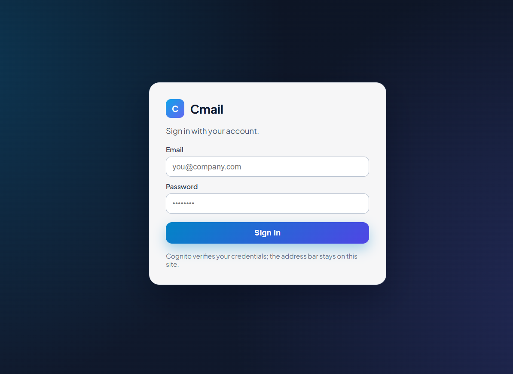
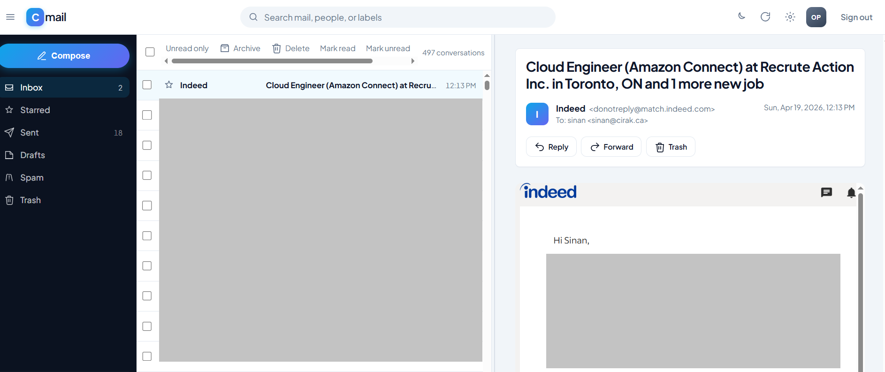
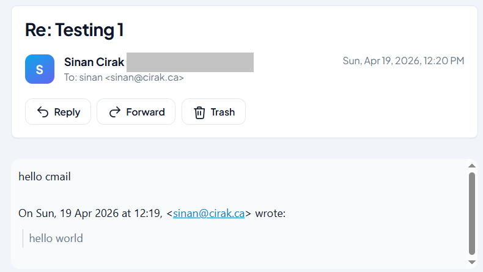
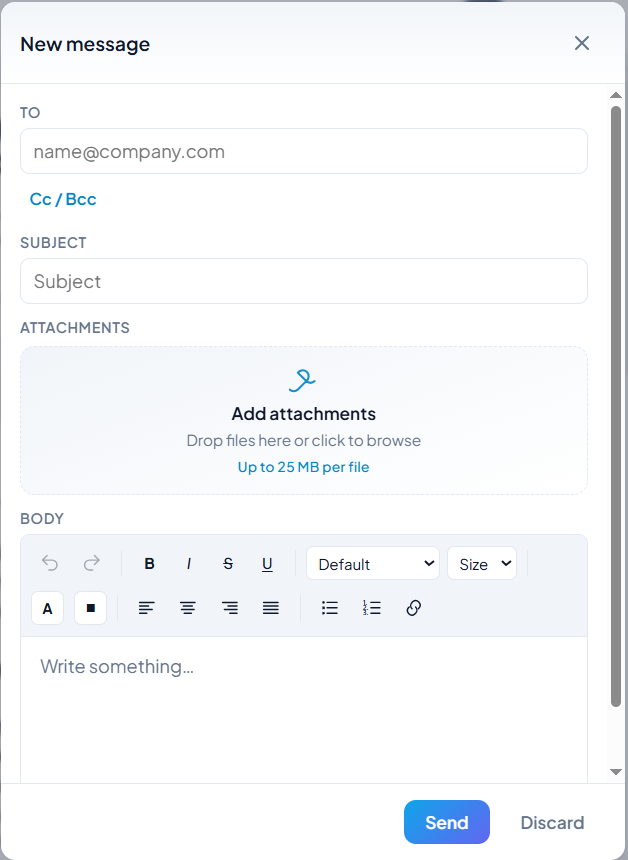
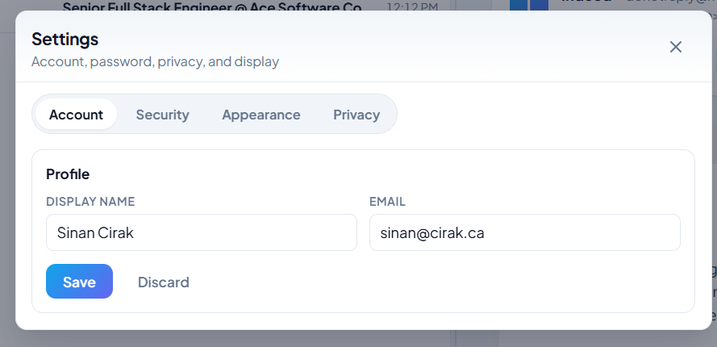
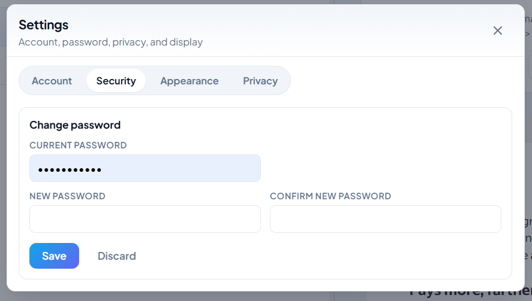
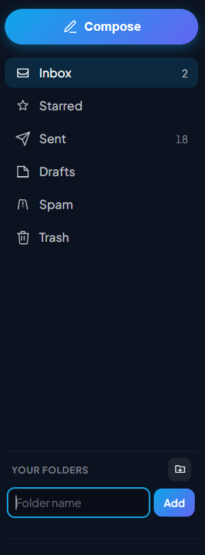
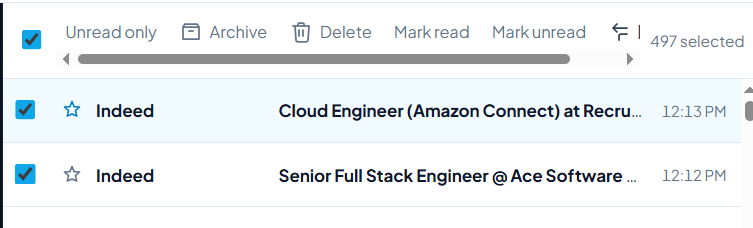
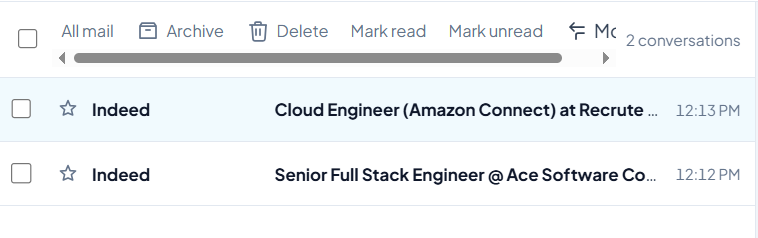

# Cmail - Cloud Mail Workspace

[](https://github.com/SinanCirak/CMail/actions/workflows/deploy-frontend.yml)

**Tech Stack:** AWS (SES, Lambda, API Gateway, DynamoDB, S3, CloudFront, Route 53, Cognito), Terraform, React, TypeScript, Vite, GitHub Actions

Cmail is a serverless email and file management system built on AWS, designed as a scalable and cost-efficient alternative to traditional email infrastructures.
Built in response to the deprecation of Amazon WorkMail.

## 📈 Impact

Designed to replace hosted mailbox dependencies with a controlled, serverless architecture where receiving, storage, search/listing, and sending are managed in your own AWS account.

## 💡 Why This Project?

With Amazon WorkMail being phased out, this project explores a practical serverless replacement path for email-like storage and operations without relying on a traditional IMAP-first server setup.

I built Cmail to run custom mail operations end-to-end on AWS with:
- **Domain-native mail flow** (receive + send) on SES
- **Private archive ownership** in S3 and metadata indexing in DynamoDB
- **User-scoped mail access** via Cognito-authenticated API routes
- **Modern mailbox UX** (thread grouping, bulk actions, read/unread state, folder management)

## 🧰 Tech Stack

- **Frontend:** React + TypeScript + Vite
- **Backend:** AWS Lambda (Python)
- **API:** AWS API Gateway (HTTP API)
- **Storage:** Amazon S3 + DynamoDB
- **Mail:** Amazon SES (inbound/outbound)
- **Auth:** Amazon Cognito
- **IaC:** Terraform
- **Delivery:** CloudFront + Route 53 + GitHub Actions

## 🏗️ Architecture

- **Frontend:** React SPA (Vite + TypeScript)
- **API Layer:** AWS API Gateway (HTTP API)
- **Backend:** AWS Lambda (Python)
- **Storage:** Amazon S3 (raw MIME/object archive) + DynamoDB (metadata index)
- **Mail Transport:** Amazon SES (inbound + outbound)
- **Auth:** Amazon Cognito
- **Infra:** Terraform

### Architecture Diagram


## 🚀 Features

### Mailbox Experience
- Multi-folder mail UI: Inbox, Sent, Drafts, Spam, Trash, custom folders
- Thread-style list grouping for reply/forward chains
- Bulk actions: move, delete, mark read/unread
- Persistent read/unread state stored in DynamoDB
- Compose with attachments and HTML body support
- Auto-refresh polling and unread counter in browser tab title

### File and Folder Management
- Drag-and-drop upload flows for compose attachments
- Folder-based navigation with system folders + user-defined folders
- File listing backed by DynamoDB metadata and S3 object keys
- Delete actions with explicit confirmation flows
- Move/archive status workflows across folder states

### Mail Inbound and Archive
- SES inbound receipt rules
- Raw MIME storage in private S3 (`raw/<mailbox>/<folder>/<uid>.eml`)
- Lambda indexing pipeline from `ses-inbound/` into user mailbox structure
- DynamoDB metadata table for listing/querying mailbox content

### Mail Outbound
- SES outbound send via API
- Sent copy persisted into archive + metadata table
- Domain identity + DKIM support via Terraform

### Auth & Security
- Cognito authentication (SRP-based sign-in flow)
- JWT-protected API routes (API Gateway + Lambda)
- User mailbox isolation by authenticated email claim
- AES256 encryption on archived objects

## ⚙️ Design Decisions

- **SES + S3 archive** instead of hosted mailbox lock-in for full ownership and portability.
- **Serverless API** to scale with demand and keep operational overhead low.
- **DynamoDB metadata index** for fast mailbox/folder queries while keeping MIME payloads in S3.
- **Terraform-first infrastructure** for reproducible, auditable setup.

## ⚙️ Design Principles

- **Serverless-first architecture:** automatic scaling with pay-per-use cost profile.
- **Secure API boundary:** no direct privileged S3 exposure from the frontend.
- **Event-driven processing:** inbound indexing and archive workflows handled by Lambda triggers.
- **Expansion-ready model:** structured to support broader multi-tenant growth patterns.

## 💡 Key Design Decisions

- **Why Lambda over EC2:** auto-scaling, zero server maintenance, and pay-per-use economics for bursty mailbox workloads.
- **Why API Gateway:** managed auth integration, routing, throttling, and stable public API front door for SPA clients.
- **Why S3 for raw mail:** durable, low-cost object storage for MIME payloads while metadata/query workload stays in DynamoDB.
- **Why no direct privileged S3 access from frontend:** keeps sensitive operations behind authenticated API policies.

## 🔍 Observability & Reliability

- Lambda + API logs and metrics in CloudWatch
- Idempotent-style object processing in inbound pipeline
- Versioned mail-data bucket to protect against accidental data loss
- Defensive API error handling (including explicit session-invalid messaging on 401)

## 🏭 Production Mindset

- **Scalable:** Lambda and API Gateway scale automatically with traffic.
- **Secure:** mailbox state operations are handled via authenticated API calls, not direct privileged client writes.
- **Cost-efficient:** fully serverless architecture with pay-per-use billing for compute and request paths.

## 🔄 CI/CD

GitHub Actions deploys the static frontend on pushes to `main`:
- install dependencies
- build Vite bundle
- sync `dist/` to S3
- invalidate CloudFront cache

Terraform applies are handled manually for controlled infrastructure and backend updates.

## 🛠️ Setup & Installation

### Prerequisites
- Node.js 18+
- Terraform 1.6+
- AWS CLI configured with permissions
- AWS account + Route 53 hosted zone for your domain

### 1) Clone and install

```bash
git clone https://github.com/SinanCirak/CMail.git
cd Cmail
npm install
```

### 2) Configure Terraform

```bash
cd terraform
cp terraform.tfvars.example terraform.tfvars
```

Set values in `terraform.tfvars` (minimum):
- `aws_region`
- `domain_name`
- `subdomain_name`
- `hosted_zone_id`
- `cognito_domain_prefix`

For full SES mail flow:
- `ses_mail_enabled = true`
- `ses_inbound_enabled = true`
- `ses_inbound_accept_all` or `ses_inbound_recipients`
- `ses_publish_dns_records = true`

### 3) Provision infrastructure

```bash
terraform init
terraform plan
terraform apply
```

### 4) Configure frontend environment

Create `.env.local` in project root:

```env
VITE_MAIL_API_URL=<terraform output api_base_url>
VITE_COGNITO_REGION=<your-aws-region>
VITE_COGNITO_USER_POOL_ID=<terraform output -raw cognito_user_pool_id>
VITE_COGNITO_DOMAIN=<terraform output cognito_domain>
VITE_COGNITO_CLIENT_ID=<terraform output cognito_client_id>
VITE_COGNITO_REDIRECT_URI=<terraform output app_url>
VITE_COGNITO_LOGOUT_URI=<terraform output app_url>
```

### 5) Run locally

```bash
npm run dev
```

App runs at `http://localhost:5173`.

## 🚀 Deployment

### Frontend (manual)

```bash
npm run build
aws s3 sync dist/ s3://<terraform output -raw site_bucket_name> --delete
aws cloudfront create-invalidation --distribution-id <distribution-id> --paths "/*"
```

### Frontend (CI)

Push to `main` and let GitHub Actions deploy static assets.

### Backend / Infra

Run `terraform apply` whenever Lambda or infrastructure changes are made.

## 📡 API Endpoints

- `GET /mail/folders`
- `GET /mail/messages?folder=<id>`
- `GET /mail/content?s3_key=<key>`
- `PATCH /mail/message` (move)
- `PATCH /mail/messages/read` (batch read/unread)
- `DELETE /mail/message`
- `POST /mail/send`
- `GET /mail/user-folders`
- `POST /mail/user-folders`
- `DELETE /mail/user-folders/{folderId}`
- `GET /me` (auth probe)

## 🖼️ Screenshots

Create a `screenshots/` folder and add these files (exact names):

- `cmail-login.png`
- `cmail-inbox.png`
- `cmail-threaded-list.png`
- `cmail-compose.png`
- `cmail-settings-account.png`
- `cmail-settings-security.png`
- `cmail-custom-folders.png`
- `cmail-bulk-actions.png`
- `cmail-unread-filter.png`

### Login


### Inbox


### Threaded List


### Compose


### Settings - Account


### Settings - Security


### Custom Folders


### Bulk Actions


### Unread Filter


## 📁 Project Structure

```text
Cmail/
├── src/
│   ├── auth/
│   ├── dashboard/
│   ├── mail/
│   └── types/
├── terraform/
│   ├── lambda/
│   ├── main.tf
│   ├── mail_api.tf
│   ├── mail_data.tf
│   ├── ses_inbound.tf
│   └── terraform.tfvars.example
├── scripts/
├── .github/workflows/
└── README.md
```

## 🔐 Security Notes

- Never commit `.env`, `.tfvars`, credentials, or mailbox secrets.
- Keep IMAP migration tooling and credentials outside git.
- Use least-privilege IAM for deploy and runtime roles.
- No direct client-side privileged S3 write paths for mailbox state.

## 🚀 Future Improvements

- Inbound processing enhancements for richer threading heuristics
- Gmail/third-party mailbox migration tooling
- IMAP-compatible bridge for legacy clients
- Enhanced multi-tenant mailbox administration
- Extended auth hardening and policy controls

## 🚀 Roadmap

- Email receiving via SES
- IMAP-like interface
- Cognito authentication hardening and policy depth
- Presigned download URLs
- Multi-user support and tenant-aware administration

## 👤 Author

Sinan Cirak
